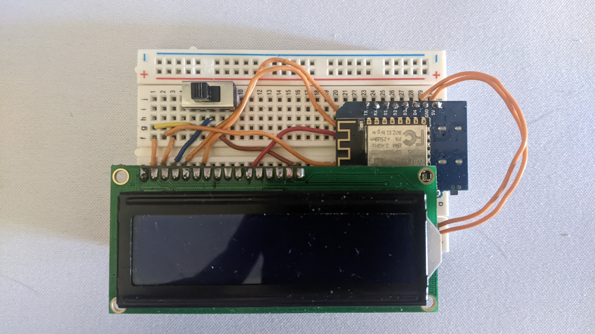
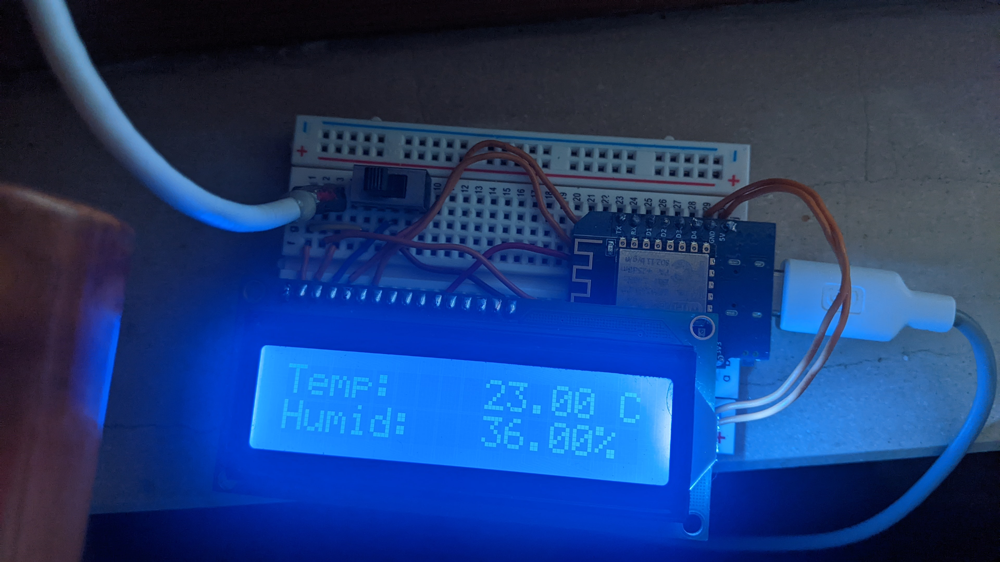
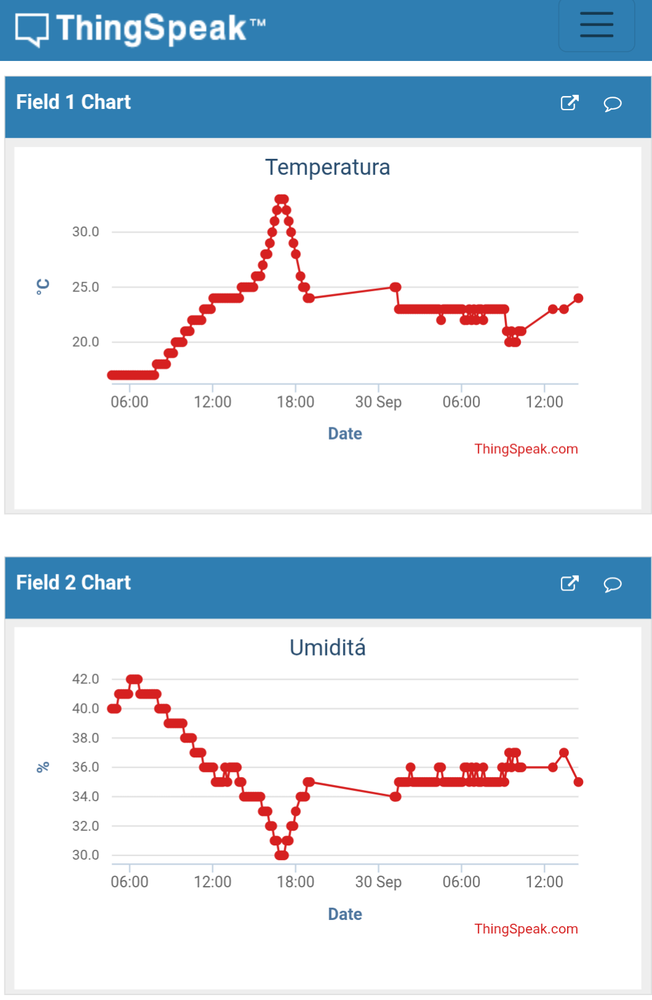

# Balcony Greenhouse - Humidity \& Temperature Monitor

Automated monitoring system for temperature and humidity in a small balcony greenhouse (40x60x120cm) using ESP8266 and DHT11 sensor.


## Features

- DHT11 sensor for temperature and humidity
- 16x2 LCD display for live data
- Data transmission to [ThingSpeak](https://www.thingspeak.com/) (online graphs)
- Built-in WiFi (ESP8266)
- Power switch for display on/off


## Hardware

- ESP8266 (NodeMCU 1.0)
- DHT11 temperature/humidity sensor
- 16x2 LCD display
- Toggle switch for display control
- USB power (5V)


## Software

- Arduino IDE 2.x
- Libraries:
  - DHT sensor library (Adafruit)
  - LiquidCrystal
  - ESP8266WiFi
  - ESP8266HTTPClient


## Folder Structure

```
Temperature-Humidity_sensor_ESP8622/
  ├── README.md
  ├── .gitignore
  ├── Temp_humi_sensor_esp8266.ino
  └── docs/
    ├── circuit.svg
    ├── ON.jpg
    └── OFF.jpg
```

## Circuit scheme


### Connections:
- \*\*D2-D7\*\*: LCD 16x2 (RS, EN, D4-D7)
- \*\*D8\*\*: DHT11 sensor
- \*\*Pin 3 LCD\*\*: Toggle switch (contrast)


## Installation

1. Clone the repository:
```bash
  git clone https://github.com/Alelucci/Temperature-Humidity_sensor_ESP8622
  cd Temperature-Humidity_sensor_ESP8622/
```
2. Open [Temp_humi_sensor_esp8266.ino](Temp_humi_sensor_esp8266.ino) in Arduino IDE

3. Install required libraries via Arduino IDE Library Manager

4. Upload to ESP8266


## Configuration

### ThingSpeak
1. Create account at [thingspeak.com](https://www.thingspeak.com/)
2. Create new channel with:
  - Field 1: Temperature
  - Field 2: Humidity
3. Copy Write API Key to code

### Local
1. Copy [secrets.h.example](secrets.h.example) to `secrets.h`
2. Fill with your credentials
3. Upload `Temp_humi_sensor_esp8266.ino` to ESP8266


## Usage

- Data updates every 2 seconds on LCD display
- Data sent to ThingSpeak every 10 minutes
- Toggle switch turns display on/off


## Results

- Online graphs on ThingSpeak dashboard
- Updates every 10 minutes (respects ThingSpeak API limits)
 


## Future Improvements

- [ ] Automatic pump/fan control based on humidity
- [ ] Light sensor integration
- [ ] Email/SMS alerts for extreme values
- [ ] Data logging to SD card

## License

MIT License - Feel free to use and modify for your own projects

